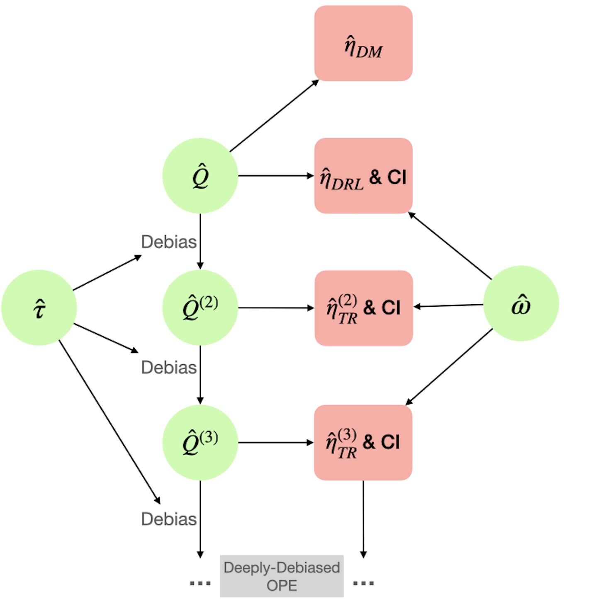
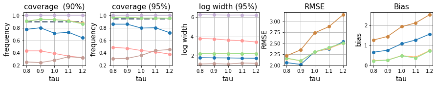

# Deeply-Debiased Off-Policy Interval Estimation (D2OPE)

This repository is the official implementation of the paper "Deeply-Debiased Off-Policy Interval Estimation" (ICML 2021) in Python.

## Summary of the paper

Off-policy evaluation learns a target policy's value with a historical dataset generated by a different behavior policy. In addition to a point estimate, many applications would benefit significantly from having a confidence interval (CI) that quantifies the uncertainty of the point estimate. In this paper, we propose a novel procedure to construct an efficient, robust, and flexible CI on a target policy's value. Our method is justified by theoretical results and numerical experiments.

Method             |  Results
:-------------------------:|:-------------------------:
  |  

## File overview
1. Code files in the main folder: 
    1. Methods: 
        1. `_TRIPLE.py`: main function for the proposed method
        1. `_IS.py`: code to implement the two IS-based competing methods
    2. Environment:
        1. `_Ohio_Simulator.py`: simulate for the `Diabates` environment
        3. `_cartpole.py`: simulate for the `Cartpole` environment, forked from OpenAI Gym,
with slight modifications. 
    4. `_util.py`: helper functions
    5. `_analyze.py`: post-process simulation results
2. `/density`: functions for estimating the two density ratio functions
3. `/coinDice`: code for the competing method "coinDice". Forked from `https://github.com/google-research/dice_rl`
4. `/target_policies`: checkpoints for the learned target policies
3. `/RL`: some useful RL functions
    1. `DQN.py` and `FQI.py`: implementation of the target/behaviour policies
    2. `FQE.py`: function for estimating the initial Q function
    4. `my_gym.py`: helper functions for training
    5. `sampler.py`: samplers and replay buffers
3. `/TOY`: code to generate the two plots for toy examples
    1. `TOY_coverage.ipynb`: for the plot showing the CI coverage
    2. `TOY_TRIPLY.ipynb`: for the plot showing the triply robust property
    3. `_plot.py`: helper functions for plotting
    4. `_discrete.py`: TR method for discrete state space
4. `/script`: scripts to run the experiments. 

## Reproduce simulation results
To reproduce our simulation experiment results, please follow the steps:

1. install the required packages 
2. change the working directory to the main folder
3. open the jupyer notebook and modify the hyper-parameters
4. run and analyze the output results
